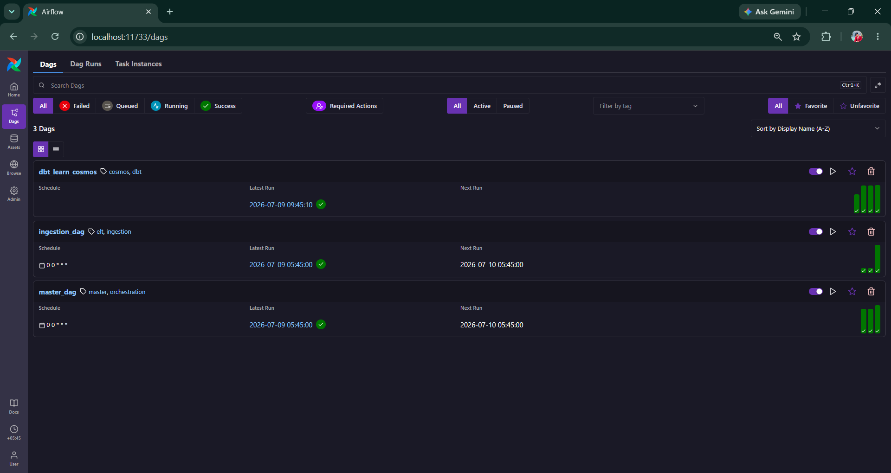
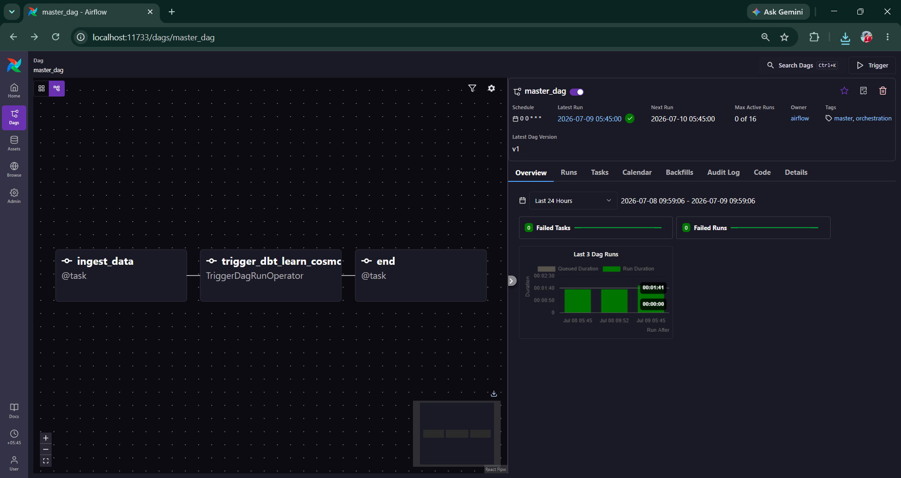
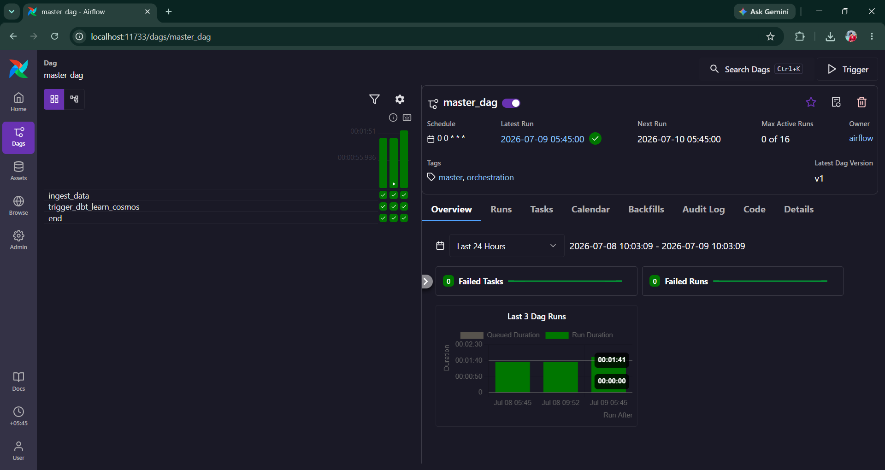
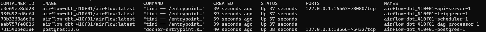
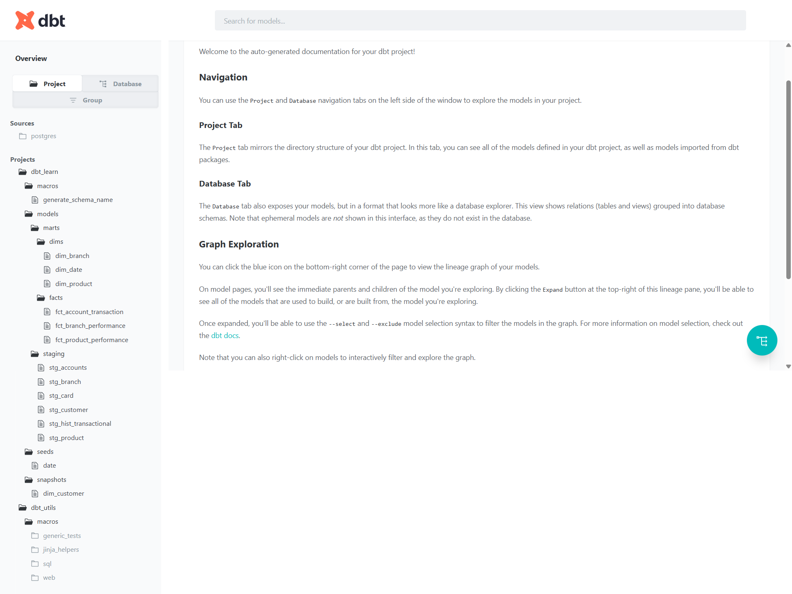
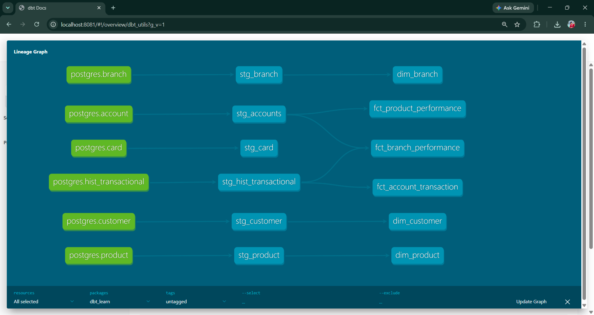
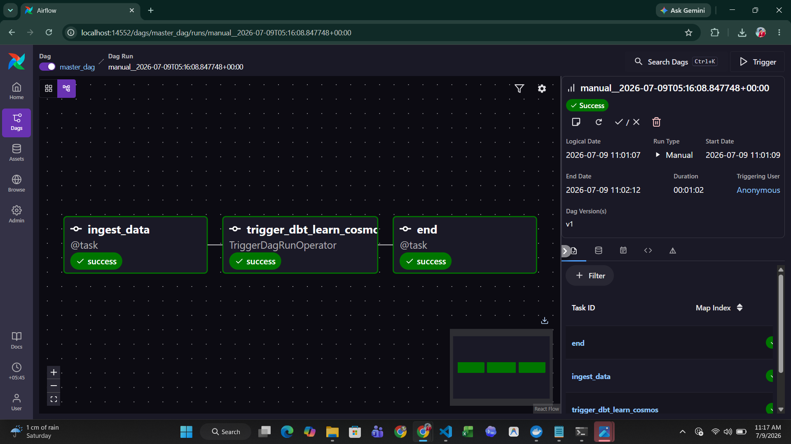

# Airflow + dbt ELT Pipeline using Astro

## Project Overview

This project demonstrates an end-to-end ELT (Extract, Load, Transform) pipeline built
using Apache Airflow, dbt, Cosmos, PostgreSQL, Docker, and Astro CLI.

The pipeline follows the Medallion Architecture (Bronze → Silver → Gold) and orchestrates
data ingestion and transformation using Airflow DAGs. Data is first ingested into the Bronze layer,
then transformed by dbt into Silver and Gold layers for analytics and reporting.

---

# Technologies Used

- Apache Airflow
- Astro CLI
- dbt (Data Build Tool)
- Cosmos
- PostgreSQL
- Docker
- Python
- SQL

---

# Project Architecture

```text
          Source Database
                 │
                 ▼
        ingestion_dag
      (Extract & Load)
                 │
                 ▼
          Bronze Layer
                 │
                 ▼
      dbt_learn_cosmos
   (dbt Transformations)
                 │
        ┌────────┴────────┐
        ▼                 ▼
   Silver Layer      Gold Layer
```

The master_dag orchestrates the pipeline by coordinating the ingestion process and triggering the dbt transformation DAG.

---

# Project Structure

```text
airflow_dbt/
│
├── dags/
│   ├── ingestion_dag.py
│   ├── master_dag.py
│   └── dbt_learn_dag.py
│
├── dbt/
│   └── dbt_learn/
│       ├── models/
│       │   ├── staging/
│       │   └── marts/
│       ├── macros/
│       ├── seeds/
│       ├── snapshots/
│       ├── tests/
│       ├── dbt_project.yml
│       ├── packages.yml
│       └── package-lock.yml
│
├── include/
├── plugins/
├── tests/
│
├── Dockerfile
├── airflow_settings.yaml
├── requirements.txt
├── packages.txt
└── README.md
```

---

# Airflow DAGs

## 1. ingestion_dag

Responsible for:

- Extracting data from PostgreSQL source tables
- Validating extracted data
- Simulating loading data into the Bronze layer
- Preparing data for dbt transformations

---

## 2. dbt_learn_cosmos

Responsible for:

- Running dbt models using Cosmos
- Executing staging models
- Building dimension tables
- Building fact tables
- Transforming Bronze data into Silver and Gold layers

---

## 3. master_dag

Responsible for:

- Coordinating the complete ELT workflow
- Running the ingestion process
- Triggering the dbt Cosmos DAG
- Managing the end-to-end pipeline

---

# dbt Models

## Staging Models

- stg_accounts
- stg_branch
- stg_card
- stg_customer
- stg_hist_transactional
- stg_product

---

## Dimension Models

- dim_branch
- dim_date
- dim_product

---

## Fact Models

- fct_account_transaction
- fct_branch_performance
- fct_product_performance

---

# How to Run

## 1. Clone the Repository

```bash
git clone https://github.com/Nabrajmadai44/airflow_dbt.git
```

---

## 2. Navigate to the Project

```bash
cd airflow_dbt
```

---

## 3. Start the Airflow Environment

```bash
astro dev start
```

---

## 4. Open the Airflow UI

```
http://localhost:8080
```

---

## 5. Execute the Pipeline

The recommended way to run the project is by executing the master_dag.

The master_dag orchestrates the workflow by running the ingestion process and triggering
the dbt_learn_cosmos DAG to perform dbt transformations.

The ingestion_dag and dbt_learn_cosmos DAGs can also be executed independently for
testing, debugging, or development purposes.

---

# Generate dbt Documentation

Generate the documentation:

```bash
dbt docs generate
```

Serve the documentation:

```bash
dbt docs serve
```

Open:

```
http://localhost:8081
```

---

# Screenshots

## Airflow DAGs



---

## Master DAG Graph



---

## Airflow Grid View



---

## Docker Containers



---

## dbt Documentation



---

## dbt Models



---

## Successful DAG Execution



---

# Features

- End-to-end ELT pipeline
- Apache Airflow workflow orchestration
- dbt integration using Cosmos
- PostgreSQL data warehouse
- Medallion Architecture (Bronze → Silver → Gold)
- Docker-based local development
- Modular Airflow DAG design
- Data validation during ingestion
- Automated dbt transformations
- dbt documentation generation

---

# Future Improvements

- Incremental model execution
- Automated data quality monitoring
- Email notifications
- Pipeline monitoring dashboard
- CI/CD using GitHub Actions
- Scheduling and production deployment

---

# Author

Nabraj Madai

Data Engineering Project

### Technologies

- Apache Airflow
- Astro CLI
- dbt
- Cosmos
- PostgreSQL
- Docker
- Python
- SQL